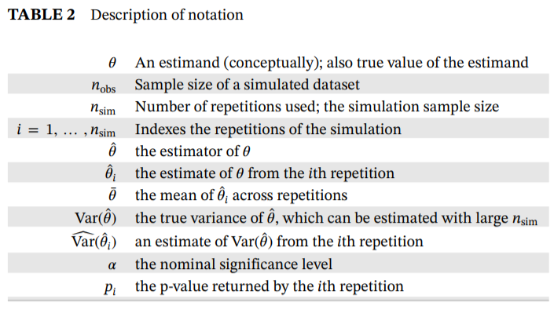
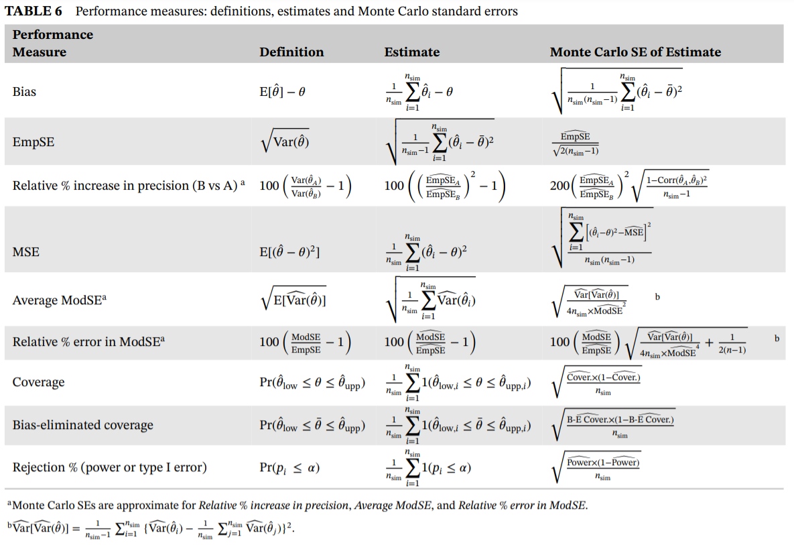
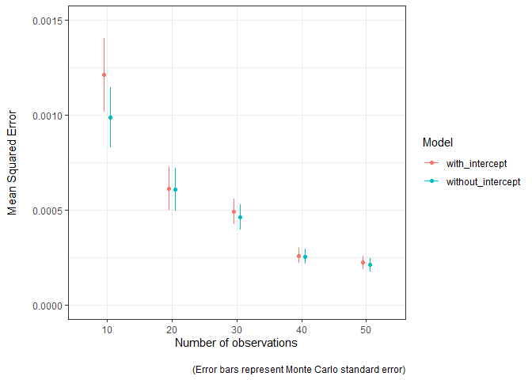

<!-- README.md is generated from README.Rmd. Please edit that file -->

# simMetric

<!-- badges: start -->
<!-- badges: end -->

`simMetric` is an R package that provides metrics (and their Monte Carlo
standard errors) for the assessment of statistical methods in simulation
studies. This package includes metrics that are calculated as per this
[tutorial](https://doi.org/10.1002/sim.8086) published by Tim Morris,
Ian White and Michael Crowther. For an in-depth description on the
calculation and interpretation, and how to perform a simulation study in
general, refer to the tutorial.

## Installation

You can install the development version of simMetric from
[GitHub](https://github.com/) with:

``` r
# install.packages("remotes")
remotes::install_github("RWParsons/simMetric")
```

Or install from CRAN

    install.packages("simMetric")

## Included Metrics (taken from [here](https://doi.org/10.1002/sim.8086)).

#### Notation



#### Metrics



# Example

Here is a basic example that performs a simulation study, evaluates the
metrics and plots the results:

``` r
library(simMetric)
library(tidyverse)
```

### define a function to generate some data and another that fits a linear model and returns some useful outputs.

### Here, we have two models that we want to compare. One of them includes an intercept term and the other doesn’t.

``` r
data_generator <- function(n_obs, noise=1, effect=0, s=42){
  set.seed(s)
  x <- rnorm(n=n_obs, mean=0, sd=1)
  y <- x*effect + rnorm(n=n_obs, mean=0, sd=noise)
  data.frame(x=x, y=y)
}

assess_lm <- function(data){
  model <- lm(y~x, data=data)
  model %>%
    broom::tidy(., conf.int=T) %>%
    filter(term=="x") %>%
    select(-any_of(c('term', 'statistic'))) %>%
    add_column(model="with_intercept")
}

assess_lm_no_intercept <- function(data){
  model <- lm(y~0+x, data=data)
  model %>%
    broom::tidy(., conf.int=T) %>%
    filter(term=="x") %>%
    select(-any_of(c('term', 'statistic'))) %>%
    add_column(model="without_intercept")
}

assess_lm(data_generator(n_obs=10, noise=0.1, effect=1))
#> # A tibble: 1 x 6
#>   estimate std.error     p.value conf.low conf.high model         
#>      <dbl>     <dbl>       <dbl>    <dbl>     <dbl> <chr>         
#> 1    0.927    0.0640 0.000000504    0.779      1.07 with_intercept
assess_lm_no_intercept(data_generator(n_obs=10, noise=0.1, effect=1))
#> # A tibble: 1 x 6
#>   estimate std.error      p.value conf.low conf.high model            
#>      <dbl>     <dbl>        <dbl>    <dbl>     <dbl> <chr>            
#> 1    0.941    0.0501 0.0000000158    0.828      1.05 without_intercept
```

### define a grid of inputs to simulate many datasets

The number of unique `seed`s represents the number of simulations to be
done (100 in this example)

``` r
g <- expand.grid(
  seed=1:100,
  n_obs=seq(from=10, to=50, by=10),
  noise=0.1,
  effect=0.5
)
```

### define a function to take that grid and a (row) index, then generates the data and return the model outputs.

Since we want to simulate the multiple models, and we want to apply the
same datasets to each set of models, we have one row returned per model
that we are simulating. This way, `fit_one_model` is run once per
simulated dataset, and the generated data is used for all included
models.

``` r
fit_one_model <- function(grid, row){
  inputs <- grid[row, ]
  d <- data_generator(
    n_obs=inputs$n_obs, 
    noise=inputs$noise, 
    effect=inputs$effect, 
    s=inputs$seed
  )
  
  cbind(
    rbind(assess_lm(d),assess_lm_no_intercept(d)),
    inputs
  )
}
```

``` r
fit_one_model(g, 1)
#> Warning in data.frame(..., check.names = FALSE): row names were found from a
#> short variable and have been discarded
#>    estimate  std.error      p.value  conf.low conf.high             model seed
#> 1 0.4483862 0.04487337 8.537408e-06 0.3449081 0.5518644    with_intercept    1
#> 2 0.4557942 0.04388530 2.608370e-06 0.3565188 0.5550697 without_intercept    1
#>   n_obs noise effect
#> 1    10   0.1    0.5
#> 2    10   0.1    0.5
```

### run all simulations in parallel and collate all the results into a `data.frame`.

``` r
library(parallel)
cl <- parallelly::autoStopCluster(makeCluster(detectCores()))
clusterExport(cl, ls()[!ls() %in% 'cl']) # send the grid and functions to each node
# x <- clusterEvalQ(cl, require(tidyverse, quietly=T)) # load the tidyverse on each node
x <- clusterEvalQ(cl, require(tidyverse, quietly=T)) # load the tidyverse on each node

start <- Sys.time()
ll <- parLapply(
  cl, 
  1:nrow(g),
  function(r) fit_one_model(grid=g, r)
)
par_res <- do.call("rbind", ll)

head(par_res)
#>    estimate  std.error      p.value  conf.low conf.high             model seed
#> 1 0.4483862 0.04487337 8.537408e-06 0.3449081 0.5518644    with_intercept    1
#> 2 0.4557942 0.04388530 2.608370e-06 0.3565188 0.5550697 without_intercept    1
#> 3 0.5239730 0.04153620 1.463669e-06 0.4281904 0.6197557    with_intercept    2
#> 4 0.5269444 0.03844832 2.464367e-07 0.4399683 0.6139206 without_intercept    2
#> 5 0.4758010 0.02818650 1.537607e-07 0.4108028 0.5407992    with_intercept    3
#> 6 0.4786038 0.02884696 4.686118e-08 0.4133474 0.5438601 without_intercept    3
#>   n_obs noise effect
#> 1    10   0.1    0.5
#> 2    10   0.1    0.5
#> 3    10   0.1    0.5
#> 4    10   0.1    0.5
#> 5    10   0.1    0.5
#> 6    10   0.1    0.5
```

## Obtaining metrics using `{simMetric}`

### Get metrics using `simMetric::join_metrics()`

``` r
df_metrics <- join_metrics(
  par_res, id_cols=c("n_obs", "model"), 
  metrics=c("coverage", "mse", "modSE", "empSE", "relativeErrorModSE"),
  ll_col="conf.low",
  ul_col="conf.high",
  true_value="effect",
  estimates_col="estimate",
  se_col="std.error"
)

head(df_metrics)
#> # A tibble: 6 x 12
#>   n_obs model   coverage coverage_mcse     mse mse_mcse  modSE modSE_mcse  empSE
#>   <dbl> <chr>      <dbl>         <dbl>   <dbl>    <dbl>  <dbl>      <dbl>  <dbl>
#> 1    10 with_i~     0.97       0.0171  1.21e-3  1.93e-4 0.0370   0.00155  0.0349
#> 2    10 withou~     0.99       0.00995 9.88e-4  1.58e-4 0.0347   0.00146  0.0315
#> 3    20 with_i~     0.94       0.0237  6.13e-4  1.14e-4 0.0248   0.000744 0.0249
#> 4    20 withou~     0.92       0.0271  6.08e-4  1.13e-4 0.0241   0.000735 0.0248
#> 5    30 with_i~     0.95       0.0218  4.92e-4  6.65e-5 0.0193   0.000408 0.0223
#> 6    30 withou~     0.92       0.0271  4.61e-4  6.55e-5 0.0189   0.000378 0.0216
#> # ... with 3 more variables: empSE_mcse <dbl>, relativeErrorModSE <dbl>,
#> #   relativeErrorModSE_mcse <dbl>
```

### Get metrics within usual tidy workflow with `group_by()` and `summarise()`

``` r
df_metrics <-
  par_res %>%
  group_by(n_obs, model) %>%
  summarise(
    coverage_estimate=coverage(true_value=effect, ll=conf.low, ul=conf.high, get="coverage"),
    coverage_mcse=coverage(true_value=effect, ll=conf.low, ul=conf.high, get="coverage_mcse"),
    mean_squared_error_estimate=mse(true_value=effect, estimates=estimate, get="mse"),
    mean_squared_error_mcse=mse(true_value=effect, estimates=estimate, get="mse_mcse")
  ) 
#> `summarise()` has grouped output by 'n_obs'. You can override using the `.groups` argument.
head(df_metrics)
#> # A tibble: 6 x 6
#> # Groups:   n_obs [3]
#>   n_obs model  coverage_estimate coverage_mcse mean_squared_er~ mean_squared_er~
#>   <dbl> <chr>              <dbl>         <dbl>            <dbl>            <dbl>
#> 1    10 with_~              0.97       0.0171          0.00121         0.000193 
#> 2    10 witho~              0.99       0.00995         0.000988        0.000158 
#> 3    20 with_~              0.94       0.0237          0.000613        0.000114 
#> 4    20 witho~              0.92       0.0271          0.000608        0.000113 
#> 5    30 with_~              0.95       0.0218          0.000492        0.0000665
#> 6    30 witho~              0.92       0.0271          0.000461        0.0000655
```

### Plot the the Mean Squared Error (MSE) as the number of observations increases

The model estimates are closer to the truth (MSE is lower) as the sample
used to fit the model increases in size. The Monte Carlo standard error
can easily be visualised to convey the uncertainty in these estimates.
The model without the intercept term seems to be a bit better, mostly
when sample sizes are lower.

``` r
df_metrics %>%
  ggplot(aes(as.factor(n_obs), mean_squared_error_estimate, group=model, colour=model)) +
  geom_point(position = position_dodge(width=0.2)) +
  geom_errorbar(aes(ymin=mean_squared_error_estimate-mean_squared_error_mcse, 
                    ymax=mean_squared_error_estimate+mean_squared_error_mcse),
                width=0, position = position_dodge(width=0.2)) +
  theme_bw() +
  labs(x="Number of observations", 
       y="Mean Squared Error\n",
       colour="Model",
       caption="\n(Error bars represent Monte Carlo standard error)") +
  scale_y_continuous(labels=scales::comma, limits=c(0, 0.0015))
```


